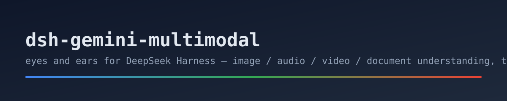

<p align="center">
  
</p>

# dsh-gemini-multimodal

Gives DeepSeek Harness **multimodal perception**: the harness model (e.g. DeepSeek) is text-only, so this plugin delegates seeing/hearing to **Gemini** — image/audio/video/document understanding, transcription, and image generation.

[English](README.md) · [中文](README.zh.md)

## Why

DeepSeek models are text-only. When a task involves a screenshot, a chart, a voice memo, a video clip, or a PDF, this plugin lets the agent actually look and listen — and keep the judgment in the main model.

## Two providers (pick one)

| provider | what it needs | when to use |
|---|---|---|
| `gemini_api` | a Gemini API key from **aistudio.google.com** | default; direct REST, fast, one HTTP call |
| `antigravity_cli` | local [`agy`](https://antigravity.google) CLI, signed in with your Google account | no key to manage; uses your Antigravity/Google One quota |

**Where to get the key (gemini_api):** go to `aistudio.google.com` → sign in with your Google account → **Get API key** → Create API key. Keys start with `AIza...` or `AQ.` — both work. Pro/Google One subscribers get the same free-tier API quota (image generation is rate-limited on the free tier).

**antigravity_cli setup:** `curl -fsSL https://antigravity.google/cli/install.sh | bash`, then run `agy` once and sign in. No key needed.

## Quick start

```sh
dsh plugin --profile web add dsh-gemini-multimodal
```

Configure in your profile/settings layer (optional — **zero-config**: with no config at all it defaults to `antigravity_cli` and works if `agy` is installed):

```yaml
- id: gemini-multimodal
  name: dsh-gemini-multimodal
  config:
    provider: gemini_api        # optional; default antigravity_cli
    api_key: <your gemini key>  # only for gemini_api
    # output_dir: /path/for/images   # generated images land here (default OS temp)
```

## Tools

| tool | what it does |
|---|---|
| `media_understand` | analyze an image / audio / video / URL (OCR, charts, UI, spoken words) |
| `media_transcribe` | verbatim text of audio/video, timestamps where useful |
| `image_generate` | text prompt → PNG saved locally (free-tier image quota is low; 429s possible) |
| `read_document` | summarize or answer questions about PDF / Office / text files |

## Security notes (antigravity_cli)

Headless `agy -p` cannot prompt for permissions, so the plugin passes `--dangerously-skip-permissions` by default. That grants the agent full tool access for that run. To tighten: set `skip_permissions: false` and add allow-rules in `~/.gemini/antigravity-cli/settings.json` (e.g. `read_file(...)`, deny `shell`). Prefer `gemini_api` when you need a narrower trust boundary.

## Privacy

- `gemini_api`: media is sent inline (base64) to Google's Gemini API — nothing stored by the plugin, key lives in your config only.
- `antigravity_cli`: media is read by the local agent and sent to Google per the agy flow.
- Nothing is logged by this plugin.

## Development

```bash
npm install
npm run typecheck
npm test          # mime mapping / agy args / smoke (no network)
npm run build
```

## License

MIT

## Changelog

- **0.1.1** — bump for CI publish validation; zero-config default provider (antigravity_cli) with friendly setup guidance.
- **0.1.0** — initial release: dual providers (gemini_api / antigravity_cli), 4 multimodal tools.
